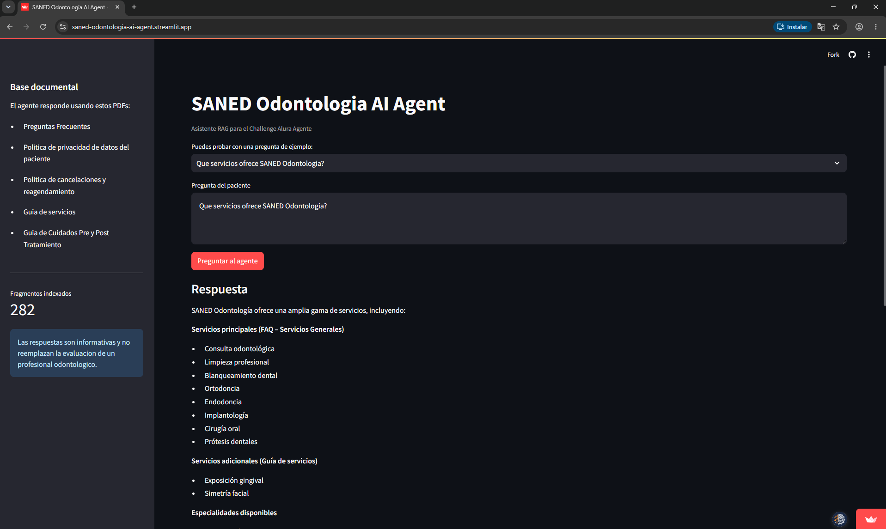
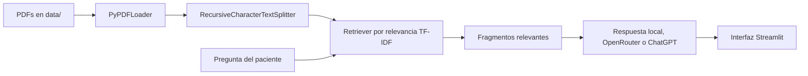
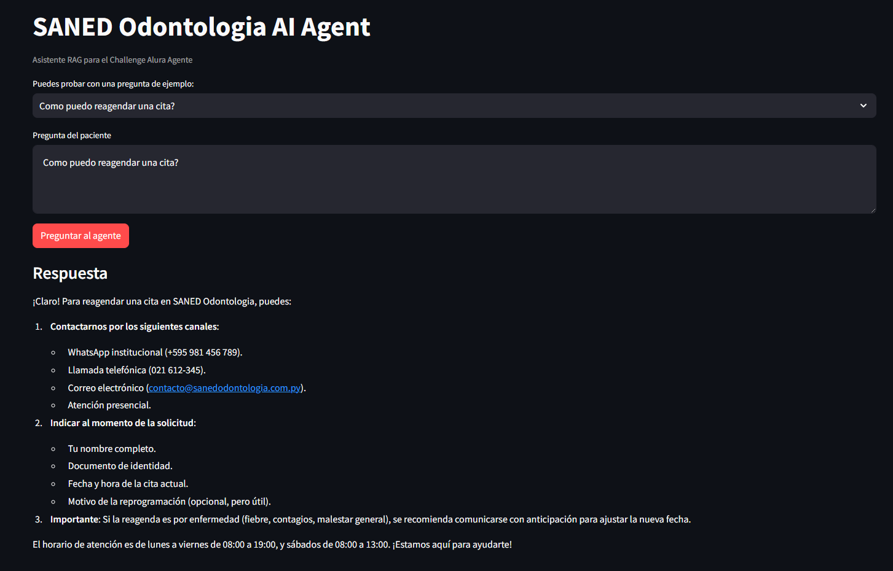
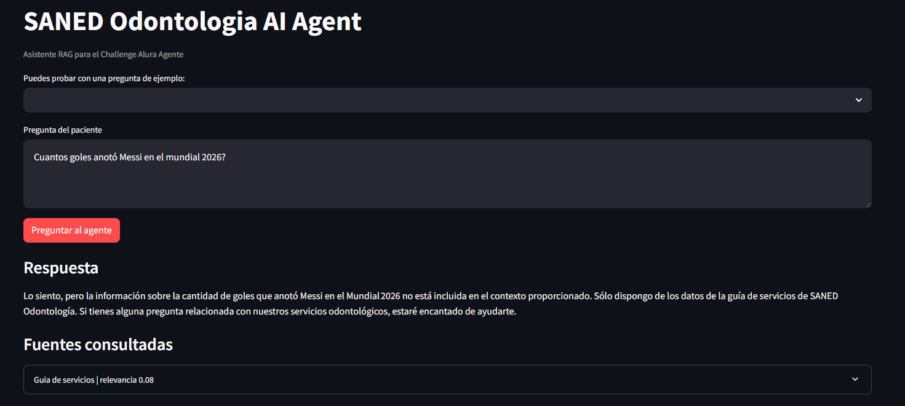

# SANED Odontologia AI Agent

Asistente virtual para SANED Odontologia, desarrollado para el Challenge Alura Agente.

El proyecto simula un agente inteligente para un consultorio odontologico. Su objetivo es responder dudas frecuentes de pacientes usando documentos oficiales de la clinica como fuente de informacion.

## Demo publica

La aplicacion esta publicada en Streamlit Community Cloud:

https://saned-odontologia-ai-agent.streamlit.app



## Problema que resuelve

En un consultorio odontologico, muchas preguntas se repiten todos los dias: servicios disponibles, cancelaciones, reagendamiento, cuidados antes o despues de un tratamiento y privacidad de datos del paciente.

Este agente ayuda a automatizar esas respuestas iniciales para que el paciente reciba orientacion rapida y el equipo de recepcion pueda enfocarse en casos que requieren atencion humana.

## Documentos utilizados

Los documentos estan en la carpeta `data/`:

- `faq.pdf`: preguntas frecuentes.
- `politica_privacidad.pdf`: politica de privacidad de datos del paciente.
- `politica_cancelaciones.pdf`: politica de cancelaciones y reagendamiento.
- `guia_servicios.pdf`: guia de servicios.
- `guia_cuidados.pdf`: guia de cuidados pre y post tratamiento.

## Arquitectura

La solucion usa una arquitectura RAG (Retrieval-Augmented Generation):



Flujo principal:

1. Los PDFs se cargan con `PyPDFLoader` de LangChain.
2. El texto se divide en fragmentos con `RecursiveCharacterTextSplitter`.
3. El agente busca los fragmentos mas relevantes para la pregunta.
4. Si existe `OPENROUTER_API_KEY`, usa OpenRouter con un modelo gratuito configurable.
5. Si no existe OpenRouter pero existe `OPENAI_API_KEY`, usa ChatGPT para generar una respuesta basada en el contexto.
6. Si no existe ninguna clave, usa un modo local extractivo para que la demo siga funcionando.
7. La respuesta se muestra en Streamlit junto con las fuentes consultadas.

## Tecnologias

- Python 3.11+
- Streamlit
- LangChain
- PyPDF
- OpenRouter opcional con modelos free
- ChatGPT / OpenAI opcional
- Git y GitHub
- Streamlit Community Cloud para el deploy publico

## Estructura

```text
.
|-- app.py
|-- data/
|   |-- faq.pdf
|   |-- guia_cuidados.pdf
|   |-- guia_servicios.pdf
|   |-- politica_cancelaciones.pdf
|   `-- politica_privacidad.pdf
|-- src/
|   |-- agent.py
|   |-- config.py
|   |-- knowledge_base.py
|   |-- models.py
|   `-- retriever.py
|-- .env.example
|-- requirements.txt
`-- README.md
```

## Como ejecutar

Crear y activar un entorno virtual:

```bash
python -m venv .venv
```

En Windows:

```bash
.venv\Scripts\activate
```

En Linux/macOS:

```bash
source .venv/bin/activate
```

Instalar dependencias:

```bash
pip install -r requirements.txt
```

Ejecutar la aplicacion:

```bash
streamlit run app.py
```

Abrir en el navegador:

```text
http://localhost:8501
```

## Configuracion opcional de OpenRouter

El agente funciona sin clave API usando modo local. Para activar respuestas generativas con OpenRouter:

1. Copiar `.env.example` como `.env`.
2. Completar `OPENROUTER_API_KEY`.
3. Opcionalmente cambiar `OPENROUTER_MODEL`.

Ejemplo recomendado con el router gratuito de OpenRouter:

```env
OPENROUTER_API_KEY=tu_clave_openrouter
OPENROUTER_MODEL=openrouter/free
```

Tambien puedes fijar un Llama free especifico, sujeto a disponibilidad y rate limits del proveedor:

```env
OPENROUTER_MODEL=meta-llama/llama-3.2-3b-instruct:free
```

Si prefieres usar OpenAI directamente, puedes configurar:

```env
OPENAI_API_KEY=tu_clave
OPENAI_MODEL=gpt-4o-mini
```

## Ejemplos de preguntas

- Que servicios ofrece SANED Odontologia?
- Como puedo reagendar una cita?
- Que pasa si cancelo mi turno?
- Como protegen mis datos personales?
- Que cuidados debo tener despues de una extraccion?
- Que debo hacer antes de un tratamiento odontologico?

## Ejemplos de respuestas

**Pregunta:** Que cuidados debo tener despues de una extraccion?

**Respuesta esperada:** El agente debe consultar la guia de cuidados pre y post tratamiento y responder con recomendaciones presentes en el documento, aclarando que la respuesta no reemplaza la indicacion profesional.

**Pregunta:** Como puedo reagendar una cita?

**Respuesta esperada:** El agente debe consultar la politica de cancelaciones y reagendamiento, explicar el procedimiento documentado y recomendar confirmar disponibilidad con SANED Odontologia.

**Pregunta:** Como protegen mis datos personales?

**Respuesta esperada:** El agente debe responder usando la politica de privacidad de datos del paciente y explicar el uso de la informacion segun la documentacion disponible.

### Evidencias de respuestas generadas

**Pregunta:** Que servicios ofrece SANED Odontologia?

**Respuesta generada:** El agente responde con servicios como consulta odontologica, limpieza profesional, blanqueamiento dental, ortodoncia, endodoncia, implantologia, cirugia oral y protesis dentales.


**Pregunta:** Como puedo reagendar una cita?

**Respuesta generada:** El agente indica canales de contacto como WhatsApp institucional, llamada telefonica, correo electronico y atencion presencial. Tambien solicita datos necesarios para identificar la cita y gestionar la reprogramacion.



**Pregunta fuera del dominio:** Cuantos goles anoto Messi en el mundial 2026?

**Respuesta generada:** El agente reconoce que la informacion no pertenece al contexto documental de SANED Odontologia y evita inventar una respuesta.



## Deploy en Streamlit Community Cloud

La aplicacion fue publicada en Streamlit Community Cloud, porque el proyecto ya esta construido con Streamlit y puede desplegarse directamente desde GitHub.

Pasos para publicar:

1. Subir el repositorio a GitHub.
2. Entrar a `https://share.streamlit.io`.
3. Crear una nueva app desde el repositorio.
4. Seleccionar la rama principal del proyecto.
5. Usar `app.py` como archivo principal.
6. Configurar los secrets de OpenRouter en la seccion avanzada.

Secrets sugeridos para Streamlit Cloud:

```toml
OPENROUTER_API_KEY = "tu_clave_openrouter"
OPENROUTER_MODEL = "openrouter/free"
```

Evidencia del deploy:

```text
URL publica en Streamlit: https://saned-odontologia-ai-agent.streamlit.app
Capturas de pantalla: docs/assets/
Fecha de deploy: 20 de julio de 2026
```

## Limitaciones

- El agente responde solo con base en los documentos incluidos.
- No reemplaza una consulta odontologica profesional.
- Si no encuentra informacion suficiente, recomienda contactar directamente a la clinica.

## Autor
Cristhian Pereira Porcal
Proyecto desarrollado para el Challenge Alura Agente.
